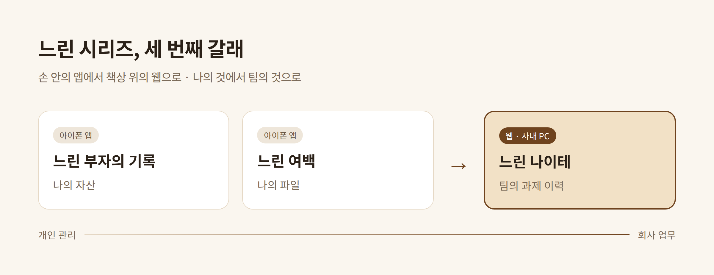
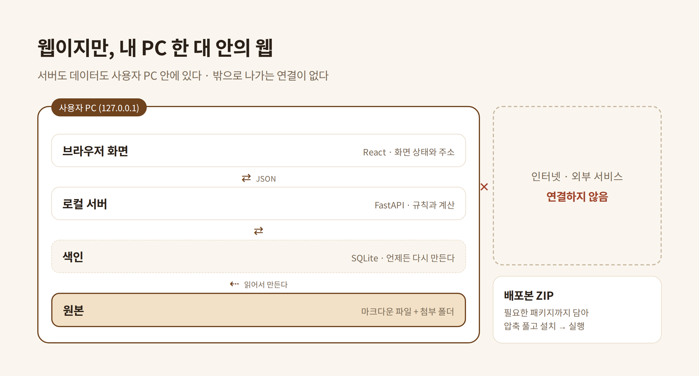
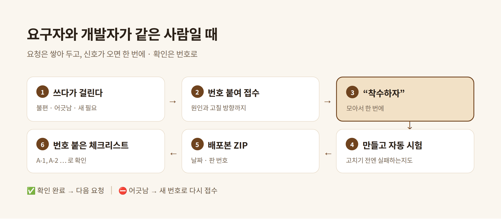
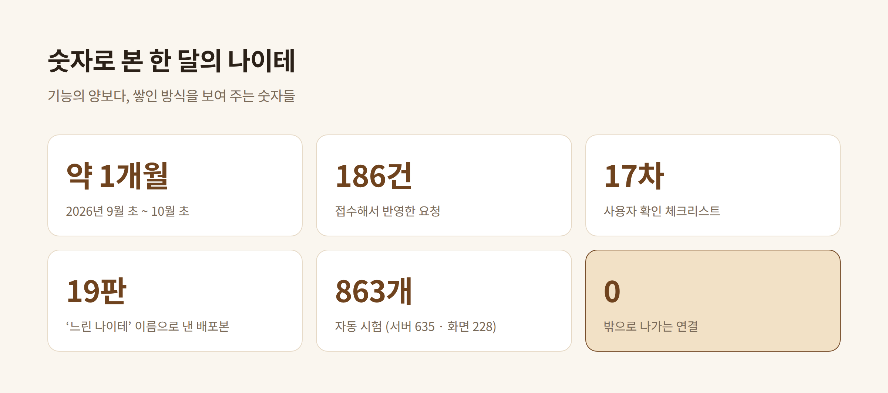

# 느린 나이테 — 이번에는 회사 일을, 웹으로

> 🔒 **네이버 블로그에 게시 완료 · 갱신하지 않습니다** (2026-10-10 사용자 확인 — "큰 수정 없이 게시").
> 게시한 글이 최종본이라 그 뒤 도구가 달라져도 이 초안은 고치지 않는다. 본문의 숫자는 **2026-10-04 기준**이다.

> 블로그 게시용 초안 (2026-10-10). *느린 부자의 기록 · 느린 여백* 에 이은 **느린 시리즈 세 번째 글**이다.
> 이미지는 모두 실제 화면이 아니라 **개념도**로 새로 그렸다 — 회사 이름 · 팀 · 사람 · 과제 내용이 들어 있지 않다.
> 게시 전 점검표는 맨 아래에 있다.

---

## 들어가며 — 손 안에서 책상 위로

지금까지 *느린 부자의 기록* 으로 자산을, *느린 여백* 으로 파일을 정리하는 아이폰 앱을 만들었습니다.
둘 다 **나를 위한, 손 안의 앱**이었습니다. 쓰는 사람도 나, 고치는 사람도 나, 데이터의 주인도 나였습니다.

세 번째 *느린 나이테* 는 두 가지가 다릅니다.

* **무대가 다릅니다.** 아이폰이 아니라 회사 PC 의 **웹 브라우저**에서 돕니다.
* **주인이 다릅니다.** 나의 자산 · 파일이 아니라, 팀이 맡은 **과제의 진행 이력**을 다룹니다.

개인 관리에서 시작한 "느린" 방식이 회사에서 쓰는 도구까지 넓어진 이야기입니다.

---

## 왜 만들었나 — 기록은 흩어지고, 보고는 감에 기댔다

팀이 맡은 과제들의 진행 내용은 개인 메모, 메일, 주간 보고용 엑셀에 흩어져 있었습니다.
마크다운 노트 앱도 써 봤지만, 업무 기록에는 **그래프 · 시험 데이터 · 보고용 엑셀 같은 첨부**가 늘 따라붙습니다.
결국 자료는 폴더에, 설명은 노트에 남고, 몇 달이 지나면 둘이 서로를 찾지 못했습니다.

더 큰 고민은 **보고**였습니다. 여러 과제 중 매주 보고하는 것은 몇 건뿐인데, 어느 과제를 올릴지는 감에 기댔습니다.
마지막 보고 뒤로 무엇이 얼마나 쌓였는지 한눈에 보이지 않으니, 오래 조용하던 과제가 뒤늦게 드러나곤 했습니다.

이런 작은 내부 도구는 개발 요청 순서에서 늘 뒤로 밀립니다. 그래서 **기다리지 않기로** 했습니다.
필요한 사람이 직접, AI 코딩 도구에 말로 설명해 가며 만드는 방식입니다.

---

## 왜 아이폰이 아니라 웹인가

처음 고민한 것은 "어디서 돌게 할까" 였습니다. 업무는 회사 PC 에서 하고, 첨부 파일도 PC 에 있습니다.
회사 PC 에는 앱 스토어가 없고, 무언가를 설치하려면 권한이 필요하며, 인터넷이 막힌 경우도 많습니다.
그런데 **브라우저는 어느 PC 에나 있습니다.** 그래서 웹으로 정했습니다.

다만 여기서 말하는 웹은 "어딘가의 서버에 올린 웹사이트" 가 아닙니다. **내 PC 한 대 안에서만 도는 웹**입니다.
서버도 데이터도 사용자 PC 안에 있고, 밖으로 나가는 연결은 하나도 없습니다. 브라우저는 그저 화면 역할만 합니다.

| | 느린 부자의 기록 · 느린 여백 | 느린 나이테 |
|---|---|---|
| 도는 곳 | 아이폰 | 회사 PC 의 브라우저 |
| 다루는 것 | 나의 자산 · 나의 파일 | 팀 과제의 진행 이력 · 첨부 · 보고 |
| 데이터가 사는 곳 | 내 폰 | 내 PC 의 폴더 (마크다운 파일) |
| 건네는 방법 | 앱 설치 | 압축 파일 하나 — 풀고, 설치하고, 실행 |
| 고치는 주기 | 내가 불편할 때 | 쓰다가 걸린 것을 모아 한 번에 |

### 기술은 이렇게 골랐습니다

파이썬 하나로 화면까지 끝내는 길도, 서버에서 화면을 그려 보내는 길도 있었습니다.
고른 것은 **서버는 데이터만 주고(JSON), 화면은 따로 만드는 길**(FastAPI + React)입니다.

* 화면을 고칠 때마다 빌드를 한 번 더 해야 하는 수고가 있습니다.
* 대신 나중에 다른 시스템 — 예를 들어 사내 AI 도구 — 에 붙일 때 **데이터 창구만 열어 주면 됩니다.**
* 빌드한 화면은 저장소에 함께 담아 두었습니다. 받는 쪽 PC 에는 **파이썬 하나만** 있으면 됩니다.

---

## 설계의 중심 — 세 가지 약속

### 1. 파일이 원본이다

모든 기록은 **평범한 마크다운 파일과 폴더**로 저장됩니다. 과제마다 폴더 하나, 그 안에 개요 문서와 날짜별 진행일지, 첨부 파일.
검색을 빠르게 하려고 데이터베이스(SQLite)를 쓰지만, 그것은 파일에서 **언제든 다시 만들 수 있는 색인**일 뿐입니다.
이 도구를 내일 버리더라도 기록은 탐색기와 메모장으로 그대로 읽힙니다. 도구는 바뀌어도 기록은 남아야 한다는 생각입니다.

### 2. 보고는 그날 그대로 남긴다

보고를 확정하면 그 시점의 내용이 **사진처럼 고정**됩니다. 나중에 진행일지를 고쳐도 "그때 무엇을 보고했는가" 는 바뀌지 않습니다.
그리고 마지막 보고 뒤로 쌓인 기록이 보이니, **다음에 무엇을 보고할지** 를 감이 아니라 기록으로 고릅니다.

### 3. 숫자는 누를 수 있고, 누르면 같은 수가 나온다

화면의 모든 숫자는 눌리고, 누르면 그 숫자만큼의 목록이 나옵니다. 당연해 보이지만 가장 자주 깨진 약속이었습니다.
"세는 곳과 보여 주는 곳이 다르다" 는 실수를 여러 번 했고, 그때마다 이 약속을 **자동 시험의 첫 줄**로 세웠습니다.

---

## 개인 도구에서 회사 도구로 — 새로 생긴 고민들

나만 쓰는 앱에서는 없던 질문이 회사 도구에서는 줄줄이 나왔습니다.

* **남에게 건넨다는 것.** 혼자 쓸 때는 이름도 아이콘도 필요 없었습니다. 옆 팀장에게 건네려는 순간 필요해졌습니다.
  그래서 *느린 나이테* 라는 이름과 나무 단면 아이콘이 생겼고, 처음 켜는 사람을 위한 안내와 도움말이 생겼습니다.
* **인터넷이 막힌 PC.** 설치에 필요한 패키지까지 압축 파일 하나에 담았습니다. 받는 사람은 풀고, 설치하고, 실행만 하면 됩니다.
  배포본마다 날짜와 판 번호를 붙여, "지금 깔려 있는 것이 어느 판인가" 를 설정 화면에서 바로 확인할 수 있게 했습니다.
* **회사의 규칙을 숫자로 옮기기.** 2년에 걸친 과제는 올해의 과제인가, 내년의 과제인가. 기대 효과 금액은 어느 해에 세는가.
  이런 것은 코드가 정할 일이 아니었습니다. 선택지를 놓고 **사람이 정하고**, 그 결정과 이유를 문서에 남긴 뒤에 만들었습니다.
* **민감한 기록.** 팀원 면담 기록을 더할 때는 일부러 검색 · AI 요약 · 내보내기에서 뺐고, 파일도 따로 두었습니다.
  나중에 여러 사람이 함께 쓰게 되더라도 그 폴더만은 나누지 않도록 처음부터 자리를 갈라 두었습니다.

개인 앱은 "내가 편하면" 끝이었지만, 회사 도구는 **"남이 처음 받아도 쓸 수 있는가"** 와 **"규칙이 숫자와 맞는가"** 를 계속 묻게 했습니다.

---

## 일하는 방식 — 접수하고, "착수하자", 그리고 번호로 확인

요구하는 사람과 만드는 사람이 같으면 일이 빠릅니다. 대신 빨라서 생기는 위험도 있습니다.
그래서 중간쯤부터 일하는 방식을 하나로 정했습니다.

1. 쓰다가 불편하거나 어긋난 것을 발견하면, 바로 고치지 않고 **번호를 붙여 접수**합니다. 원인과 고칠 방향까지 적어 둡니다.
2. 어느 정도 모이면 **"착수하자"** 한마디로 한 번에 반영합니다.
3. 고친 것마다 자동 시험을 붙입니다. **고치기 전 코드에서는 실패하는지** 까지 확인합니다.
4. 압축 파일(배포본)을 만들어 실제 PC 에 덮어씁니다.
5. **A-1, A-2 … 처럼 번호가 붙은 확인 목록**을 받아, 하나씩 눌러 보고 결과를 번호로 돌려줍니다.
6. 어긋난 것은 다시 새 번호로 접수됩니다.

예를 하나 들면 이렇습니다. 확인 목록을 보던 중 "사람을 골랐는데, 다시 전체로 돌아가는 방법이 안 보인다" 는 항목이 걸렸습니다.
새 번호로 접수해 돌아가는 단추를 만들었더니, 다음 확인에서 "그 단추가 연도 고르는 칸 옆에 있으니 어색하다" 는 답이 왔습니다.
들여다보니 그 자리는 화면 전체의 조건처럼 읽혔고, 실제로 바뀌는 것은 아래 두 칸뿐이었습니다. 그래서 **바뀌는 칸 바로 위**로 옮겼습니다.
작은 일이지만, 혼자 만들고 혼자 쓰는 앱에서는 이렇게 한 번 더 묻는 과정이 생기지 않았을 것 같습니다.

같은 실수가 반복되는 것도 보였습니다. 그래서 따로 **회고 문서**를 두고, 실수를 모양별로 묶어 다음 프로젝트 첫날의 점검표로 만들어 두었습니다.

---

## 숫자로 본 한 달

기능이 몇 개냐보다, **어떻게 쌓였는지** 를 보여 주는 숫자들입니다.
요청 186건이 모두 번호로 남아 있고, 확인 목록은 17차까지 갔으며, 자동 시험은 860개가 넘습니다.
그리고 밖으로 나가는 연결은 처음부터 끝까지 0 입니다.

---

## 마치며 — 한 해에 한 겹

나무는 한 해에 한 겹씩 굵어집니다. 이 도구도 그렇게 쓰입니다. 주마다 한 줄씩 적고, 해가 바뀌면 그 해가 얼마나 굵었는지 봅니다.
빨리 만들었지만, 쓰임새는 느립니다. **쌓여야만 보이는 것**을 담는 도구라서 이름을 *느린 나이테* 로 지었습니다.

*느린 부자의 기록* 과 *느린 여백* 이 나를 위한 앱이었다면, *느린 나이테* 는 처음으로 **남이 받아 쓰는 것**을 생각하며 만든 도구입니다.
다음 단계는 다른 팀장들이 각자 써 보는 것, 그리고 그 경험이 쌓이면 여럿이 함께 쓰는 것입니다. 그때 또 한 겹을 적겠습니다.

---

## 게시 전 점검표 (게시할 때는 이 절을 지운다)

- [ ] **회사 이름 · 부서 · 팀 이름**이 본문 · 이미지 어디에도 없다 — 이 초안에는 없다
- [ ] **사람 이름**(팀원 · 보고 대상 · 면담 상대)이 없다 — 없다
- [ ] **실제 과제명 · 과제 번호 · 금액 · 일정**이 없다 — 숫자는 도구의 규모(요청 수 · 시험 수 · 판 수)뿐이다
- [ ] **실제 화면 캡처**가 없다 — 이미지 다섯 장은 아이콘과 새로 그린 개념도다
- [ ] 사내 시스템 · 내부 플랫폼의 **고유 이름**이 없다 — "사내 AI 도구" 처럼 일반 명사로만 적었다
- [ ] 회사 내부 분류 체계(과제 분류 이름 · 보고 양식)가 그대로 드러나지 않는다
- [ ] 저장소 주소 · 내부 경로 · 배포본 파일을 링크하지 않는다
- [ ] 앞의 두 글과 **말투**(존댓말 · 문장 길이 · 소제목 모양)를 맞췄다 — 이 초안은 "~습니다" 체로 썼다
- [ ] *느린 부자의 기록 = 자산, 느린 여백 = 파일* 이라는 소개가 앞의 글과 맞다
